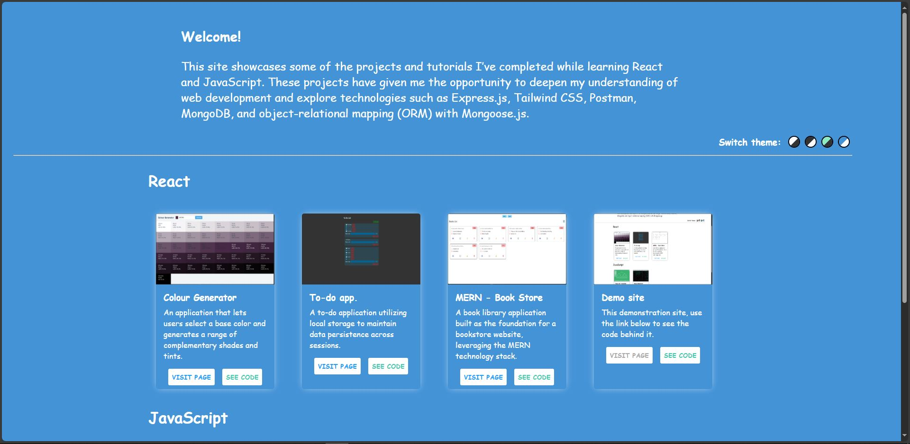

# React demo site

---

### Description

This is a React application showcasing some of the projects and tutorials I’ve completed while learning React and JavaScript.

### Screenshots

    

### Functionality

- View different projects as cards.
- Navigate to either the code (GitHub repo) or the website (GitHub pages) using the provided buttons.
- Alter the theme.

### Requirements

- A web browser
- Node.js
- git

### How to use

To use the application, you can either go [here](https://luke663.github.io/demo-site/) to see the app. hosted via GitHub pages or host it locally by completing the following steps:

- Clone the application.
  - Open a command terminal
  - Go to the directory on your computer where you wish to put the repository.
  - Run the commands:
    - git clone https\://github.com/Luke663/demo-site
    - cd demo-site
    - npm install
- Run the application.
  - Run the command:
    - npm run dev
  - Click (or copy and paste into a browser) the local address that appears in the terminal.

### License

This is a demonstration project and not intended for collaboration, as such a license has not been added meaning the default copyright laws apply and no one may reproduce, distribute, or create derivative works from this work.
